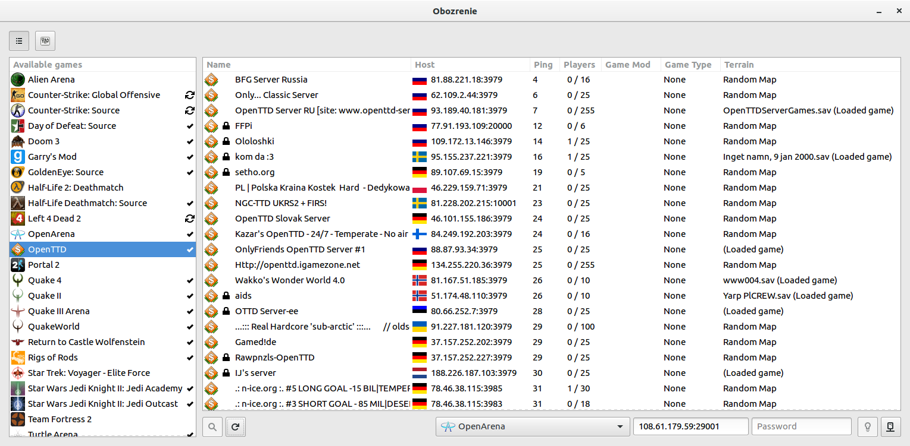

Simple and easy to use game server browser for Linux.

## Overview
Obozrenie is a game server browser that can be used to access information about and connect to multiplayer servers.

## Features
- Fast, fully threaded stat engine
- Easy to use, elegant, uncluttered GUI
- Supports various backends, designed for modularity.

## Screenshot

## Dependencies
### Required:
- [CMake](https://cmake.org)
- [Boost 1.58+](http://boost.org)
- [gtkmm 3.20+](https://gtkmm.org/)
- [libxml++ 2.40+](https://developer.gnome.org/libxml++/stable/)
- [JsonCpp](https://github.com/open-source-parsers/jsoncpp)
- [GeoIP C API](https://github.com/maxmind/geoip-api-c)

### Optional:
- [QStat](https://github.com/multiplay/qstat) - for QStat backend support

## Installing
    $ mkdir build && cd build && cmake ..
    $ make
    # make install

## Licenses
### Obozrenie
This program is free software; you can redistribute it and/or modify it under the terms of the GNU General Public License version 3, as published by the Free Software Foundation.

This program is distributed in the hope that it will be useful, but WITHOUT ANY WARRANTY; without even the implied warranty of MERCHANTABILITY or FITNESS FOR A PARTICULAR PURPOSE. See the GNU General Public License for more details.

### Obozrenie logo
This logo uses Neometric typeface by [Andres Sanchez](http://andresl.tumblr.com) distributed under CC-BY-SA-NC.
